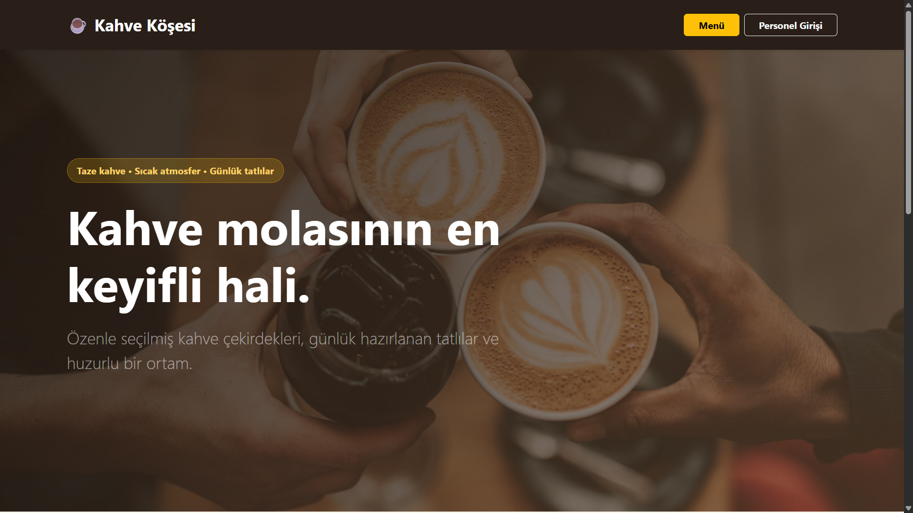
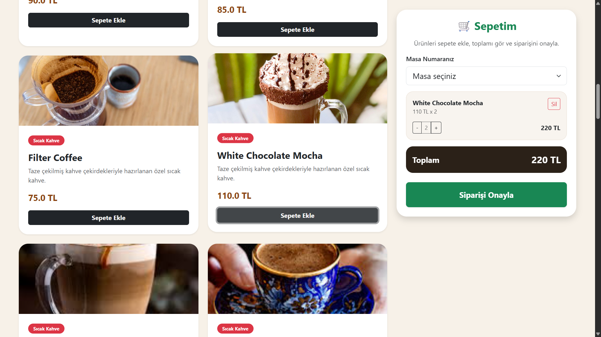
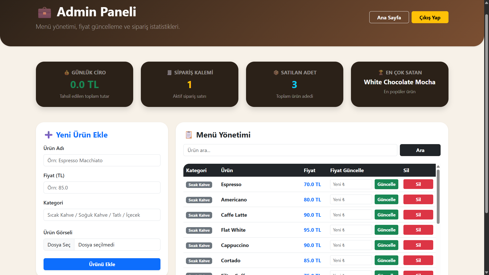
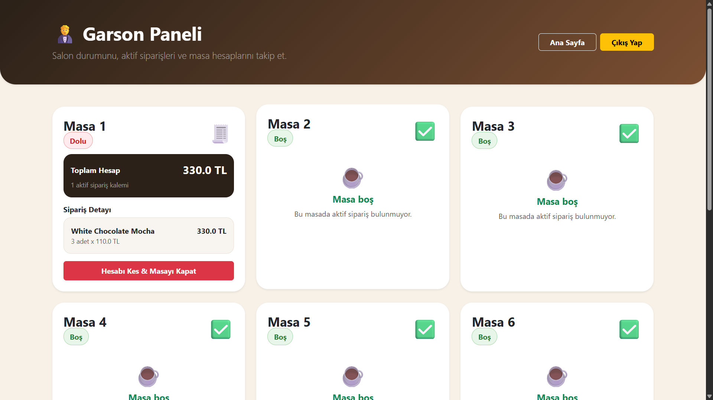

# ☕ Kahve Köşesi

Modern cafe/restoran işletmeleri için geliştirilmiş çok katmanlı dijital sipariş ve yönetim sistemi.

---

# 📌 Proje Hakkında

Kahve Köşesi; müşterilerin QR / masa üzerinden sipariş verebildiği, garsonların siparişleri yönetebildiği ve yöneticilerin işletmeyi kontrol edebildiği Spring Boot tabanlı cafe otomasyon sistemidir.

Bu proje modern web mimarileri kullanılarak geliştirilmiştir.

---

# ✨ Temel Özellikler

## 👤 Müşteri Deneyimi

* Dijital menü görüntüleme
* Kategorilere ayrılmış ürünler
* Ürün görselleri
* Çoklu ürün seçimi (Sepet sistemi)
* Toplam fiyat hesaplama
* Masa üzerinden sipariş oluşturma

## 🤵 Garson Paneli

* Canlı masa takibi
* Masa doluluk yönetimi
* Aktif sipariş görüntüleme
* Toplam hesap görüntüleme
* Hesap kesme ve masa kapatma

## 💼 Yönetici Paneli

* Menü yönetimi
* Ürün ekleme / silme / güncelleme
* Ürün arama sistemi
* Ürün görsel yükleme sistemi
* Günlük satış takibi
* Sipariş istatistik dashboardu

---

# 📊 Dashboard Özellikleri

* Günlük ciro görüntüleme
* Toplam sipariş sayısı
* Satılan toplam ürün adedi
* En çok satan ürün analizi

---

# 🔒 Güvenlik Sistemi

Proje içerisinde rol tabanlı yetkilendirme sistemi kullanılmıştır.

### Roller

### Admin

```text
Menü yönetebilir
Ürün ekleyebilir
Ürün silebilir
Fiyat güncelleyebilir
İstatistikleri görebilir
```

### Garson

```text
Siparişleri yönetebilir
Masaları kapatabilir
Canlı salon takibi yapabilir
```

---

# 🏗 Kullanılan Yazılım Mimarisi

```text
Controller Layer
↓
Service Layer
↓
Repository Layer
↓
Database
```

Kullanılan mimariler:

* MVC Architecture
* Layered Architecture
* DTO Pattern
* Repository Pattern
* Exception Handling
* Validation Structure

---

# 🛠 Kullanılan Teknolojiler

* Java
* Spring Boot
* Spring Security
* Spring MVC
* Spring Data JPA
* Hibernate
* Thymeleaf
* Bootstrap
* Lombok
* H2 Database

---

# 📁 Proje Yapısı

```text
src
├── controller
├── service
├── repository
├── entity
├── dto
├── config
├── exception
├── templates
├── static
└── uploads
```

---

# 🔍 Spring Data Derived Query Methods

Projede Derived Query Method yapıları kullanılmıştır.

Örnek:

```java
findByNameContainingIgnoreCase(String name);
```

---

# ⚙ Kurulum

Clone:

```bash
git clone <repo-url>
```

Projeyi çalıştır:

```bash
mvn clean install

mvn spring-boot:run
```

Uygulama:

```text
http://localhost:8080
```

---

# 🔑 Demo Kullanıcılar

## Admin

```text
username : admin
password : patron
```

## Garson

```text
username : garson
password : 123
```

---

# 📷 Ekran Görüntüleri

## 🏠 Ana Sayfa



---

## ☕ Menü Sayfası



---

## 💼 Admin Paneli



---

## 🤵 Garson Paneli



---

# 👨‍💻 Developer

**Abdullah Okyay**

Yönetim Bilişim Sistemleri
